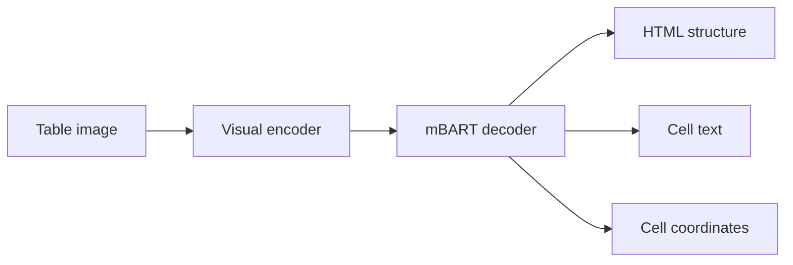
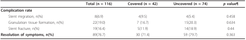
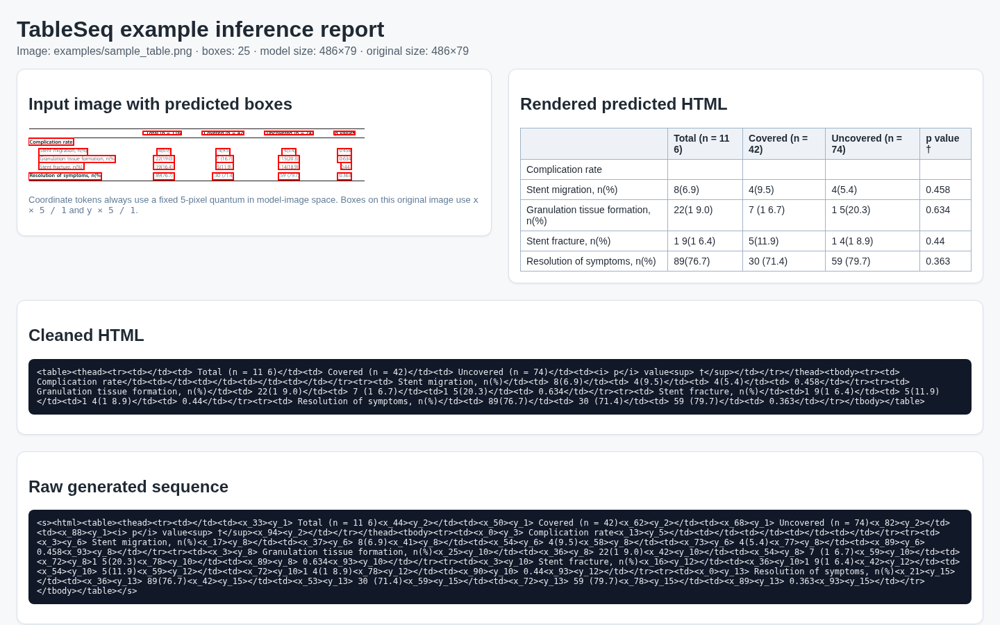

# TableSeq

[](https://www.python.org/)
[](LICENSE)
[](https://doi.org/10.1007/s10032-026-00586-6)
[](https://zenodo.org/records/21597715)

**TableSeq** is an image-to-sequence model that jointly generates table structure, cell content, and cell coordinates in one autoregressive sequence.



This repository provides training, full-split evaluation, and single-image inference with visual cell-box overlays.

## Pretrained weights and tokenizer

Pretrained artifacts are available on Zenodo:

**https://zenodo.org/records/21597715**

The current release contains:

- a checkpoint trained on **PubTabNet**;
- the matching tokenizer required to load that checkpoint.

Additional dataset-specific checkpoints will be added in later releases. After downloading and extracting the archive, pass the `.pt` checkpoint path to `--checkpoint` and the tokenizer directory to `--tokenizer` or `--tokenizer-path`.

Use a checkpoint only with its matching tokenizer. The tokenizer must contain the HTML, text, and coordinate tokens expected by the model.

## Installation

```bash
git clone https://github.com/hamdilaziz/TableSeq.git
cd TableSeq
python -m venv .venv
source .venv/bin/activate  # Windows: .venv\Scripts\activate
python -m pip install --upgrade pip
python -m pip install -e .
```

For development:

```bash
python -m pip install -e ".[dev]"
pytest
```

## Quick start

After extracting the pretrained artifacts, run inference on the included sample image:

```bash
tableseq-infer \
  --checkpoint path/to/pubtabnet_checkpoint.pt \
  --tokenizer path/to/tokenizer \
  --image examples/sample_table.png \
  --output-dir outputs/demo
```

The equivalent module command is:

```bash
python -m tableseq.run_tableseq \
  --checkpoint path/to/pubtabnet_checkpoint.pt \
  --tokenizer path/to/tokenizer \
  --image examples/sample_table.png \
  --output-dir outputs/demo
```

Inference writes:

- `prediction_raw.txt`: raw generated sequence;
- `prediction.html`: sanitized predicted table;
- `prediction_boxes.json`: generated cell coordinates;
- `prediction_boxes.png`: box overlay on the input image;
- `prediction.jsonl`: prediction metadata;
- `report.html`: self-contained visual report.

## Example output

A pre-generated example is included so the output format can be inspected without running the model.

**Input image**

<p align="center">
  
</p>

**Generated inference report**

<p align="center">
  <a href="examples/sample_report.html">
    
  </a>
</p>

[Open the self-contained HTML report](examples/sample_report.html). It contains the box overlay, rendered table, cleaned HTML, and raw generated sequence.

The sample image is adapted from a CC BY 2.0 source. See [`examples/ATTRIBUTION.md`](examples/ATTRIBUTION.md) for attribution and licensing details.

## Maximum sequence length

The released configuration uses a maximum sequence length of **2048 tokens** for training, validation, evaluation, and inference. This covers most samples used in the experiments, but not all of them. Adding four coordinate tokens per localized cell makes dense or text-heavy tables substantially longer than structure-and-content-only sequences.

If generation reaches 2048 tokens before producing the end-of-sequence token, the output is truncated. The final cells, coordinate tokens, or closing HTML tags may therefore be missing. A truncated prediction should not automatically be interpreted as a coordinate-scaling error.

Choose `--max-length` before training and use the same value for evaluation and inference. Increasing it raises memory consumption and requires a checkpoint whose decoder positional embeddings were trained for the selected length.

## Sequence representation

A localized cell is represented using HTML, text, and four coordinate tokens:

```html
<td><x_20><y_10>Example<x_60><y_18></td>
```

The coordinate tokens represent `(x1, y1, x2, y2)`. One coordinate-token unit always corresponds to **5 pixels in the image presented to the model**.

When an image is resized, TableSeq transforms coordinates automatically. For a resize factor of `1.5`:

```text
training token = original pixel × effective image scale / 5
original pixel = generated token × 5 / effective image scale
```

The effective horizontal and vertical scales are computed from the actual resized dimensions, so integer rounding and optional maximum dimensions are handled consistently.

## Dataset format

Expected layout:

```text
dataset_root/
├── labels_with_boxes_org.pkl
├── train/
│   └── image.png
├── valid/
│   └── image.png
└── test/
    └── image.png
```

The label file must contain:

```python
{
    "ground_truth": {
        "train": {
            "image.png": {
                "text": "<table>...</table>",
                "prompt": "<html>",
            }
        },
        "valid": {},
        "test": {},
    }
}
```

Coordinate tokens should normally refer to the original image. The data loader scales them to the selected model-input resolution. Use `--labels-already-resized` only when label coordinates already match the resized model-input images.

> [!WARNING]
> Pickle files and PyTorch checkpoints can execute code when loaded. Use files only from trusted sources.

## Training

```bash
python scripts/train_tableseq.py \
  --dataset-root path/to/dataset_root \
  --tokenizer-path path/to/tokenizer \
  --output-dir outputs/train \
  --resize-factor 1.5 \
  --max-length 2048 \
  --batch-size 1 \
  --valid-batch-size 1
```

Use `--checkpoint path/to/checkpoint.pt` to initialize from existing TableSeq weights. Training stores `last.pt` and `best.pt` under `OUTPUT_DIR/checkpoints/`, together with the preprocessing metadata required by evaluation and inference.

The default best-checkpoint metric is S-TEDS. A different metric can be selected, for example:

```bash
--metric-for-best valid_box_iou
```

Full content-aware TEDS is optional because it is slower:

```bash
--compute-teds
```

## Evaluation

```bash
python scripts/eval_tableseq.py \
  --dataset-root path/to/dataset_root \
  --tokenizer-path path/to/tokenizer \
  --checkpoint outputs/train/checkpoints/best.pt \
  --split valid \
  --output-dir outputs/eval_valid
```

The evaluator reports the same non-loss validation metrics used during training:

- structure-sequence similarity, S-TEDS, and optional TEDS;
- box IoU, matched IoU, F1 at 0.50 and 0.75, box-count error, and coordinate L1 error;
- generated sequence length;
- teacher-forced token, coordinate-token, X-token, and Y-token accuracy.

Outputs are saved as JSONL predictions, a per-sample CSV file, and an aggregate JSON summary.

Checkpoints produced by this repository store their resize factor automatically. For older checkpoints without preprocessing metadata, pass the training resize factor explicitly with `--resize-factor`.

## Repository layout

```text
tableseq/
├── coordinates.py       # coordinate scaling and decoding
├── data.py              # dataset, preprocessing, and collation
├── inference.py         # single-image inference and reports
├── modeling.py          # end-to-end encoder-decoder model
├── models/              # visual encoder and mBART decoder
└── training/            # trainer, metrics, and token noise
scripts/
├── train_tableseq.py
├── eval_tableseq.py
└── infer_tableseq.py
examples/                # sample input, report, preview, and attribution
tests/
```

## Citation

```bibtex
@article{hamdi2026tableseq,
  title   = {Tableseq: unified generation of structure, content, and layout},
  author  = {Hamdi, Laziz and Tamasna, Amine and Boisson, Pascal and Paquet, Thierry},
  journal = {International Journal on Document Analysis and Recognition},
  year    = {2026},
  doi     = {10.1007/s10032-026-00586-6}
}
```

Citation metadata is also available in [`CITATION.cff`](CITATION.cff).

## License

TableSeq is released under the [Apache License 2.0](LICENSE). The modified mBART implementation retains its upstream Hugging Face copyright and license notice. The example image is distributed under CC BY 2.0 with attribution documented separately.
